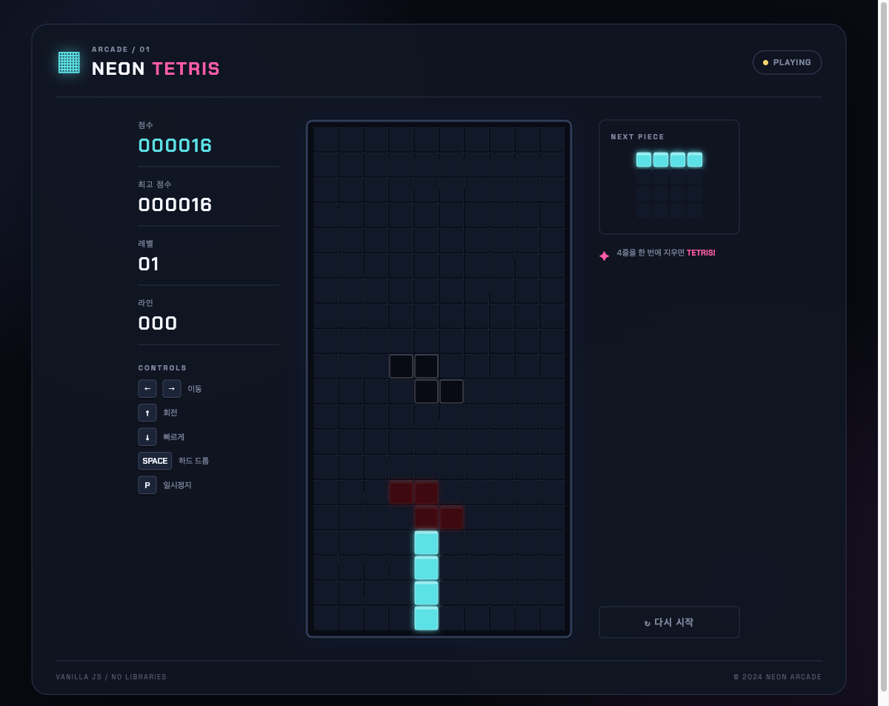
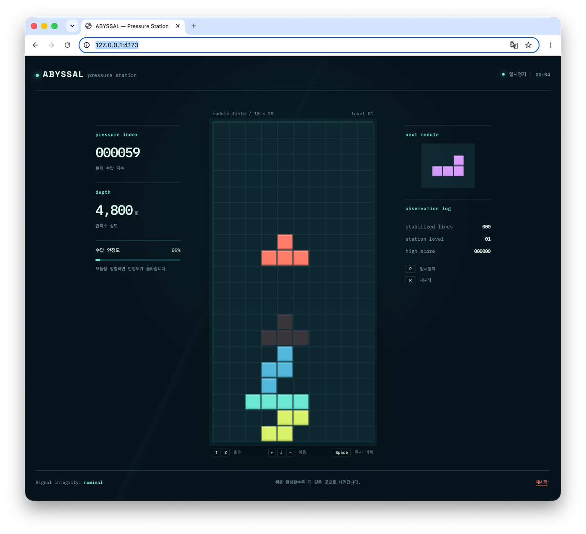
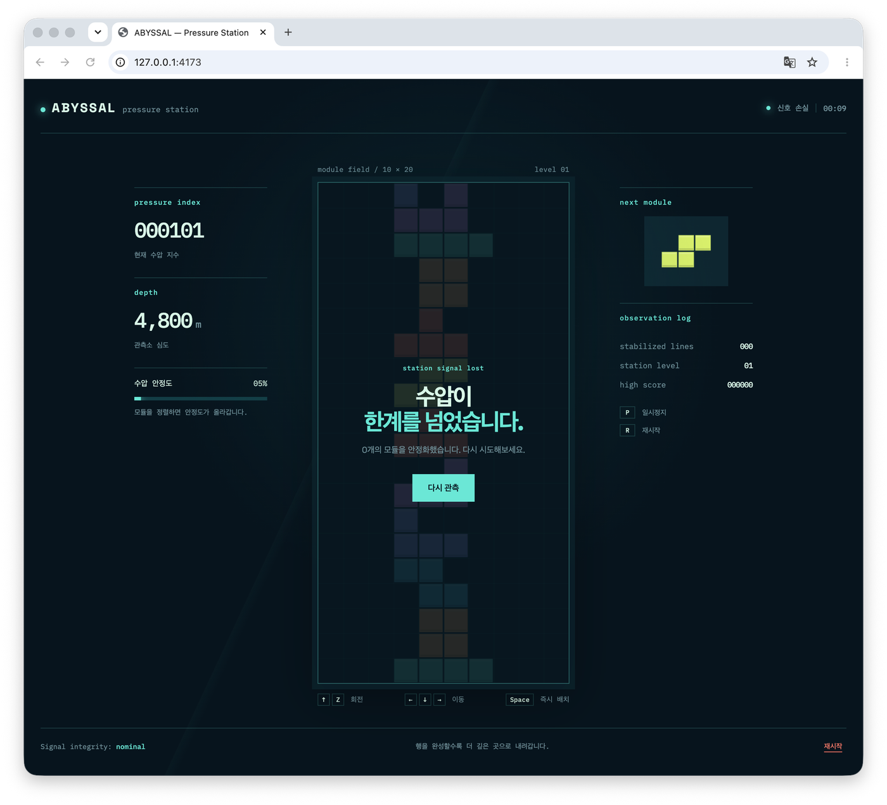
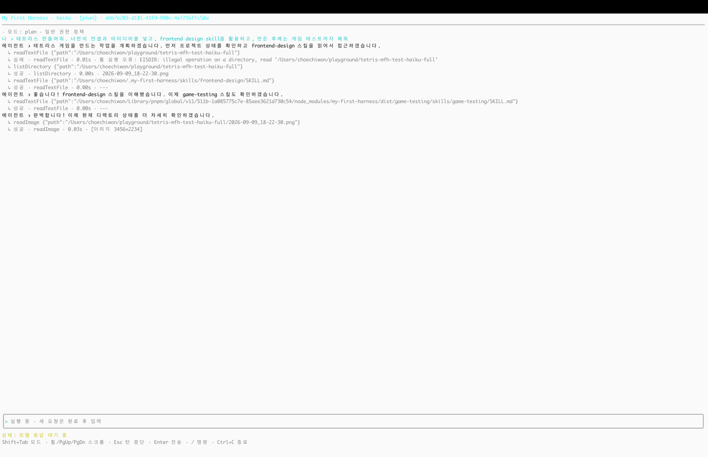

# my-first-harness

## bagelcode Dash-backery team onboarding assignment

과제:

온보딩 프로젝트 - 자체 하네스 제작

시스템 프롬프트 기능, 세션 기능, 툴 기능, 스킬 기능 정도
API가 돌아갈때 들어가야되는 툴과 컨텍스트,

위 목표 습득 지식을 습득하는게 목적

## 구현 범위
- 턴(유저 입력 1회), 스텝(한 턴에서 돌아가는 여러 번의 LLM 호출 각각)을 구분한 **에이전트 루프**. 툴 호출이면 실행 후 결과를 넣어 다음 스텝, 출력 한도에 걸리면 작업을 나누도록 피드백, Esc로 턴 중단
- **컨텍스트 조립**(시스템 프롬프트, 스킬 목록, MCP 툴 이름 목록, 작업 디렉터리, 모드 지침, 작업 폴더의 `AGENTS.md`, 과거 대화, 툴 정의)
- **세션**(프로젝트별 저장, `/new`, `/resume`)과 **실행 기록**(메시지 원문·API 요청/응답·툴 호출·사용량을 JSONL로 보존)
- **컨텍스트 관리**(모델별 예산으로 자동 압축 시점 결정, 긴 툴 결과 앞뒤만 남기기, 오래된 구간만 요약하고 최근 기록은 원문 유지)
- **멀티 API**(하네스 공통 형식 + Chat Completions / Responses / Anthropic Messages 어댑터. Bakery Farm Luna, AIProxy Luna, Haiku)
- **툴**(내장 플러그인 단위로 등록, JSON Schema 인자 검증, 오류는 모델에게 결과로 전달, 백그라운드 셸 작업)
- **MCP**(stdio·http 서버 연결, 툴 이름만 먼저 넣고 `ToolSearch`로 정의를 점진 공개)
- **스킬**(전역 `~/.my-first-harness/skills`, 프로젝트 `.my-first-harness/skills`, 플러그인 소유 스킬. 목록에는 이름·설명·위치만 넣고 본문은 모델이 읽음)
- **모드와 권한**(plan/edit 모드, 툴별 승인·세션 승인·yolo, 계획 제출과 사용자 검토)
- **이미지 입력**(`/attach`, 툴 결과 이미지, 원본 보관과 요청용 축소)
- **CLI·TUI**(코어는 이벤트만 내고 화면은 바꿔 끼움)
- **게임 테스트 플러그인**(Playwright MCP 프로세스 안의 컨트롤러로 게임 시계를 정지·감속하고, 모델이 화면을 보고 키를 넣는 플레이 테스트. 적용 확인 → 반응 지연 측정 → 배속 결정 → 플레이의 절차를 스킬이 안내)

## 최종 산출물

하네스가 만든 테트리스와 실행 화면이다. 전역 설치한 `my-first-harness`로 빈 폴더에서 시작했다.

### NEON TETRIS — Luna, 한 번의 요청



바닐라 JS, 라이브러리 없음. 점수·최고 점수·레벨·라인, 다음 조각, 조작 안내(← → 이동, ↑ 회전, ↓ 빠르게, Space 하드 드롭, P 일시정지).

### ABYSSAL — Pressure Station — Luna, frontend-design 스킬



심해 관측소 컨셉. 조각은 "모듈", 줄을 지우면 모듈이 안정화되어 수압 안정도가 오르고 더 깊은 곳으로 내려간다. 수압 지수·심도·안정도 게이지, 다음 모듈, 관측 로그.



게임 오버는 "수압이 한계를 넘었습니다". 안정화한 모듈 수를 보여주고 다시 관측으로 재시작한다.

### TUI 실행 화면 — Haiku, plan 모드



`my-first-harness haiku --tui`. 요청 "테트리스 만들어줘. 너만의 컨셉과 아이디어를 넣고, frontend design skill을 활용하고, 만든 후에는 게임 테스트까지 해줘"에 모델이 frontend-design·game-testing 스킬 본문을 읽고 폴더를 확인하는 장면. 위는 대화와 툴 호출 로그, 아래는 입력창·상태·키 안내.

## Quick start

### 1. 저장소 복제

```bash
git clone git@github.com:chiwonchoi-bagelcode/my-first-harness.git
cd my-first-harness
```

### 2. 의존성 설치

```bash
pnpm install
```

Node.js 24 이상. Playwright MCP가 띄울 브라우저(Chrome)가 필요하다.

### 3. API 키 설정

```bash
cp .env.example .env
```

생성된 `.env`에 `BCF_API_KEY`(Bakery Farm)와 `AIPROXY_TOKEN`(AI Proxy)을 입력한다.

### 4. 실행

```bash
node my-first-harness.ts              # Farm Luna, CLI
node my-first-harness.ts haiku --tui  # 모델: farm / luna / haiku, --tui로 화면 UI
```

Node.js가 `.ts`를 직접 실행하므로 빌드가 필요 없다. 실행하면 현재 세션 ID와 입력 프롬프트가 표시된다.

```text
session: <session-id>
>
```

### 사용자 명령어

```text
/new                        새 대화를 시작한다
/resume [session-id]        목록에서 고르거나 ID로 세션을 연다
/compact                    현재 대화를 요약해 컨텍스트를 줄인다
/attach "/path/to/img.png"  다음 메시지에 이미지를 첨부한다
/skills /tools /plugins /mcp  목록을 보고 켜거나 끈다
/reload-skills              전역·프로젝트 스킬 파일을 다시 읽는다
/reload-instructions        작업 폴더의 AGENTS.md를 다시 읽는다
/mode plan|edit|yolo        작업 모드 (TUI에서는 Shift+Tab)
/permissions default|yolo   yolo는 모든 툴 권한 검사를 우회한다
/quit                       작업과 연결을 정리하고 종료한다
```

CLI는 `/new /resume /compact /attach /mode /permissions /reload-instructions /quit`를 지원한다.

### 저장 위치

- 세션 스냅샷과 실행 기록: `~/.my-first-harness/projects/<폴더명>-<경로 해시>/<session-id>.json`, `.jsonl`
- 프로젝트 스킬: `.my-first-harness/skills/<name>/SKILL.md`. 전역 스킬은 `~/.my-first-harness/skills/`. 같은 이름은 프로젝트가 우선한다
- 내장 플러그인: `tools/`. `builtin-plugins.ts`에 추가한다
- MCP 서버: `mcp-servers.ts`. 기본은 memory(stdio), playwright(stdio)
- 켜고 끈 설정: `.my-first-harness/settings.json`

## 테스트

```bash
pnpm test                    # 모의 응답 테스트. 네트워크 없음
pnpm exec tsc --noEmit       # 타입 검사
pnpm build                   # dist/로 변환
```

실제 서버·모델을 쓰는 검증은 따로 실행한다. `--model`이 붙는 것은 유료다.

```bash
pnpm test:mcp                            # 실제 MCP 서버 연결
pnpm test:playwright [--model farm]      # 실제 브라우저 조작
pnpm test:game-testing [--model farm]    # 게임 시계 정지·감속, 플러그인 경로, 모델 플레이 루프
pnpm test:responses / test:anthropic / test:farm / test:images / test:history
pnpm test:prompts [haiku|farm]           # 시스템 프롬프트 전후 비교
pnpm test:package                        # pack → 임시 전역 설치 → 다른 폴더에서 실행
```

## 전역 설치 (`my-first-harness` 명령으로 임의 폴더에서 실행)

macOS ARM64, Node.js 26, pnpm 11.25에서 검증했다.

### 1. pnpm 전역 실행 경로 설정 (한 번만)

```bash
pnpm setup
```

`~/.zshrc`에 `PNPM_HOME`과 `PATH`가 추가된다. 끝나면 터미널을 새로 연다.

### 2. 빌드·패키징

```bash
pnpm pack --out dist/my-first-harness-1.0.0.tgz
```

`prepack`이 `pnpm build`를 자동 실행한다. `.env`, 세션, 테스트는 패키지에 들어가지 않는다.

### 3. 전역 설치

```bash
pnpm add -g --config.node-linker=hoisted ./dist/my-first-harness-1.0.0.tgz
```

`--config.node-linker=hoisted`가 필요한 이유: memory MCP 서버가 `zod`를 선언 없이 import해서 pnpm의 격리된 전역 설치에서는 찾지 못한다. 코드를 고친 뒤에는 2·3번을 다시 실행한다.

### 4. API 키

설치 폴더의 `.env`는 읽지 않는다. 사용자 전역 파일에 둔다.

```bash
mkdir -p ~/.my-first-harness && chmod 700 ~/.my-first-harness
printf 'BCF_API_KEY=...\nAIPROXY_TOKEN=...\n' > ~/.my-first-harness/.env
chmod 600 ~/.my-first-harness/.env
```

우선순위는 셸 환경변수 > 작업 폴더의 `.env` > `~/.my-first-harness/.env`이다.

### 5. 실행

```bash
cd ~/some-project
my-first-harness              # Farm Luna, CLI
my-first-harness haiku --tui  # Haiku, TUI
```

작업 디렉터리는 명령을 실행한 폴더다. 그 폴더에 `.my-first-harness/`(Playwright 출력, 프로젝트 스킬, 설정)가 생기고 `AGENTS.md`가 있으면 프로젝트 지침으로 읽는다. `.my-first-harness/mcp-playwright/`는 프로젝트의 `.gitignore`에 넣는다. Playwright MCP는 브라우저 창을 실제로 연다.

개발 중에는 설치 대신 소스를 바로 실행하는 alias가 편하다.

```bash
# ~/.zshrc
mfh() { node ~/my-first-harness/my-first-harness.ts "$@"; }
```

## Study Log

- 학습 기록: `docs/my-first-harness-project.pdf`
- 구현 결정과 검증 기록: `docs/codex-dev-log/`
- 협업 원칙: `AGENTS.md`
